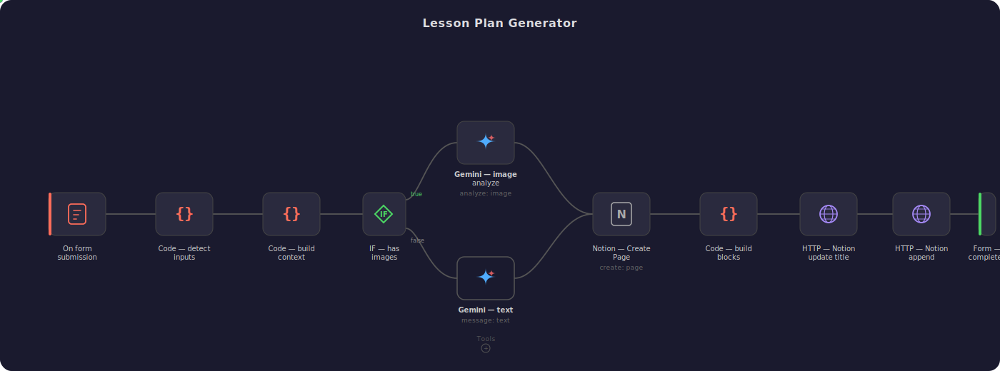

# Lesson Plan Generator

An n8n automation that turns any Spanish lesson topic or material into a complete, ready-to-teach lesson plan — powered by Gemini AI and saved directly to Notion.

Upload screenshots of your class material **or** simply type a topic, and the workflow generates a full structured lesson.

---

## How It Works

  

### 1. Submit Input
A web form where you either:
- **Upload screenshots** of your online class material (textbook pages, exercises, vocabulary lists)
- **Type a topic** (e.g. "food vocabulary", "past tense irregular verbs") and let the AI build the lesson from scratch

### 2. Smart Routing
The workflow automatically detects the input type and routes it:
- **Images** → Gemini vision analyzes the screenshots
- **Text** → Gemini generates a lesson from the topic

### 3. AI Lesson Builder
Gemini 2.5 Flash processes the input and generates a structured lesson plan including:

- Completed exercises with correct answers
- Vocabulary definitions with examples
- Teaching tips and extra notes
- Additional vocabulary related to the class theme
- Extra practice exercises (fill-in-the-blank, true/false, matching, etc.)
- A writing exercise with requirements and example
- A conversation exercise for real-life practice
- Student comments and observations based on the topic

### 4. Save to Notion
The lesson is automatically created as a Notion page, with the title updated and content appended in structured blocks — ready to use in class.

---

## Target Level

A2-B1 Spanish learners. Explanations are clear, simple, and accessible.

---

## Stack

| Component | Technology |
|-----------|------------|
| Automation | [n8n](https://n8n.io) |
| AI Model | Google Gemini 2.5 Flash |
| Storage | Notion API |

---

## Setup

1. Import the workflow into your n8n instance
2. Configure credentials for Google Gemini and Notion
3. Activate the workflow
4. Open the form URL and upload screenshots or type a topic
